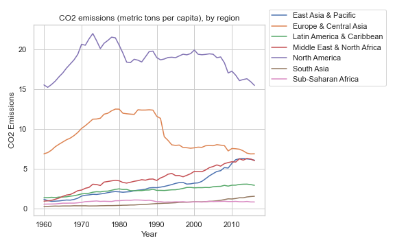

Environmental, Social and Governance (ESG) is altering markets as inventors continue to expand and dedicate funding towards green recovery in companies and countries. According to Bloomberg, ESG Global AUM has seen steady growth across developed countries, and is poised to see 2-digit growth over the long run and a projected $140+ trillion global totals by 2025. Sovereign ESG debt is also expected to swell in an unprecedented rate as countries borrow with the goal of achieving environmental and social targets. JPMorgan [foresees the global sales of ESG bonds](https://www.bloomberg.com/news/articles/2021-02-04/jpmorgan-s-esg-debt-head-expects-sustainability-linked-bond-boom]) to be between $120 and $150 billion by the end of 2021.

Here, we will touch upon international efforts like the Kyoto Protocol that drove sovereign ESG initiatives and discuss the success and failures of them through data trends from the World Bank. We will also examine several risk factors that arise from ESG in the macroeconomic environment such governance and credit risks.

###### Background

Signed in late 1997 and adopted in 2005, the Kyoto Protocol was an international agreement that defined long-term goals for climate change policies on stabilizing greenhouse gas emissions, with a focus on carbon dioxide emissions. The protocol was only directed towards developed countries. As an incentive, countries that uphold the Kyoto Protocol were allowed to participate in carbon credit trading and were provided “emission credits”. 

Many agree that while the Kyoto Protocol had good intentions, it ultimately failed as many of the developed countries were unable to cut down emissions. Furthermore, the treaty [provided feeble support](https://documents.worldbank.org/curated/en/669801521338458808/pdf/Tanzania-CPF-FY18-22-SECPO-February-14-02212018.pdf) towards developing countries to cut down emissions. As we will illustrate in the graphs below, we will see that the protocol actually allowed for an increase in CO₂ emissions among high-income countries. 

In the United States, the protocol was supported by then-President Clinton and Vice President Al Gore, but was turned down by the Senate. Later administrations also virtually made no attempts to push the agenda further. 

An interesting argument for the lack of interest in the U.S. in the early 2000s can be attributed to the overpowering narrative on combating terrorism driven by the 9/11 attacks. The Kyoto Protocol had called for lesser missile defense, hands off approach towards the Middle East, along with [high economic costs](https://sloanreview.mit.edu/article/the-lessons-of-kyoto-2/) towards the U.S. for cutting emissions.

Following the Kyoto Protocol, there were at least two significant agendas that aimed to address climate change and to suppress greenhouse gas emissions: The United Nation (UN) Sustainable Development Goals and the Paris Agreement.

The UN Sustainable Development Goals were set up in 2015 as an archetype to address global climate challenges by promoting 17 goals are countries to follow, ranging a broad spectrum from poverty to water rights, industry innovation to clean energy.

The Paris Agreement, on the other hand, serves as a more rigorous version of the Kyoto Agreement, with more serious attempts in data collection and enforcement. The main goal of the Paris Agreement is to have a stronger response to the danger of climate change and suppress greenhouse gas emissions.

For now, it is too early to understand the impacts of both initiatives, but we are looking forward to discern its effects in the next few years.

###### Quantitative Data

We collected and analyzed data from the [World Bank’s ESG Data Draft](https://datacatalog.worldbank.org/dataset/environment-social-and-governance-data), which captured of 60+ economic indicators across 190+ economies from 1960 to 2019. We will look for correlations between greenhouse gas emissions and GDP, as well as historical trends on emissions across income groups and regional groups. For our purposes, we use the term “high-income countries” and “developed countries” interchangeably. 

The graphs below exhibit international trends on nitrous oxide (N₂O), methane (CH₄), and carbon dioxide (CO₂) emissions, fossil fuel energy consumption, and their relationship with GDP.

###### Income Groups

_N₂O & CH₄_

In nitrous oxide emissions as well as methane emissions, high income and lower middle-income countries are seeing a steady decrease, while upper middle income and middle-income countries’ emissions dip at 2000, and are seeing an increase later on. Low income countries’ nitrous oxide and methane emissions have been decreasing since 2007.

_CO₂_

High income countries take the lead in CO₂ emissions, driven by its consumerism and higher demand for travel. We can also note the failure of the Kyoto Protocol. Throughout the late 1990s, CO₂ emissions among high-income countries actually increased, despite the ratification and participation in the protocol among developed countries. Upper middle income, middle income, and lower middle-income countries are seeing an all-time high in CO₂ emissions, succeeding a transient dip throughout the 1990s. CO₂ emissions in low income countries has seen a steady decrease since the 1990s.

_Fossil Fuel_

In high income countries, fossil fuel energy consumption has steadily decrease to below 80%, down from the high of 95% from the 1960s. Upper middle-income countries, middle income countries, and lower middle-income countries see an all-time high in fossil fuel energy consumption while low income countries have the lowest percentage of fossil fuel energy consumption at around 25% of its total consumption.

###### Regional Groups

_N₂O & CH₄_

Nitrous oxide and methane emissions follow a close relationship among each other. North America has done a relatively impressive job in decreasing its nitrous oxide and methane emissions since the 1970s. By 2015, methane emissions is at 1.5 metric tons of CO₂ equivalent per capita, down from 3.0 metric tons from 1970s—close to a 50% decrease. Nitrous oxide emissions in North America has also fell from 1.5 to 0.9 metric tons by 2015.

_CO₂_

For CO₂, emissions from North America and Europe & Central Asia have been steadily trending down, while emissions from Middle East & North Africa, East Asia & Pacific are trending up, and emissions from Latin America & Caribbean, South Asia, and Sub-Saharan Africa have stayed relatively constant.

_Fossil Fuel_

The regions of Middle East & North Africa are seeing an all-time high in fossil fuel energy consumption, reaching close to 100% of total energy consumption. This is followed by East Asia & Pacific and Latin America & Caribbean. North America and Europe & Central Asia has seen a steady decrease in fossil fuel energy consumption, while South Asia is seeing a drastic increase in its consumption and Sub-Saharan Africa’s consumption has been relatively unchanged.

_Changes in GDP vs. CO₂ emissions_

Among high-income countries, there was a steady correlation between GDP and CO₂ emissions changes, however, we notice a shift after 2008. With a marginal increase or decrease in GDP, the CO₂ emissions changes of high-income countries often follow on the same direction. 

###### Incorporating Risks

Many risks come with sovereign ESG investing including governance risks, physical risks, and even reporting risks. Governance risks have largely dominated the narrative, which are determined by the rule of law and government effectiveness, an administration’s ability to formulate and implement sound policies, and the prospect of political stability. Quantitative data such as the above dataset from the World Bank only portrays one side of the story, clever investors must also incorporate political surroundings of a country to fully understand its ESG picture.

Given the rubric of ESG scores as well as UN SDG and the Paris Agreement, countries can have the incentive to skew their data collection in order to allow bias that would depict themselves as “greener” countries, thus contributing to reporting risks and risks on data biases.

###### Implementations & Next Steps

As investors allocate funding towards countries that had higher ESG scores—in this case, highly-developed countries, it would in turn mean lesser funding towards developing countries.  The inequality gap between both groups would grow and pull the ESG score spectrum further and further, inevitably leaving developing countries with insufficient, albeit crucial capital to advance ESG goals.

With the acceleration of ESG disclosure requirements and healthy pressure applied by intergovernmental organizations, we should expect more consistent and unified reporting amongst countries. It would be insightful to observe the impact and efficacy of the Paris Agreement and UN SDGs.
